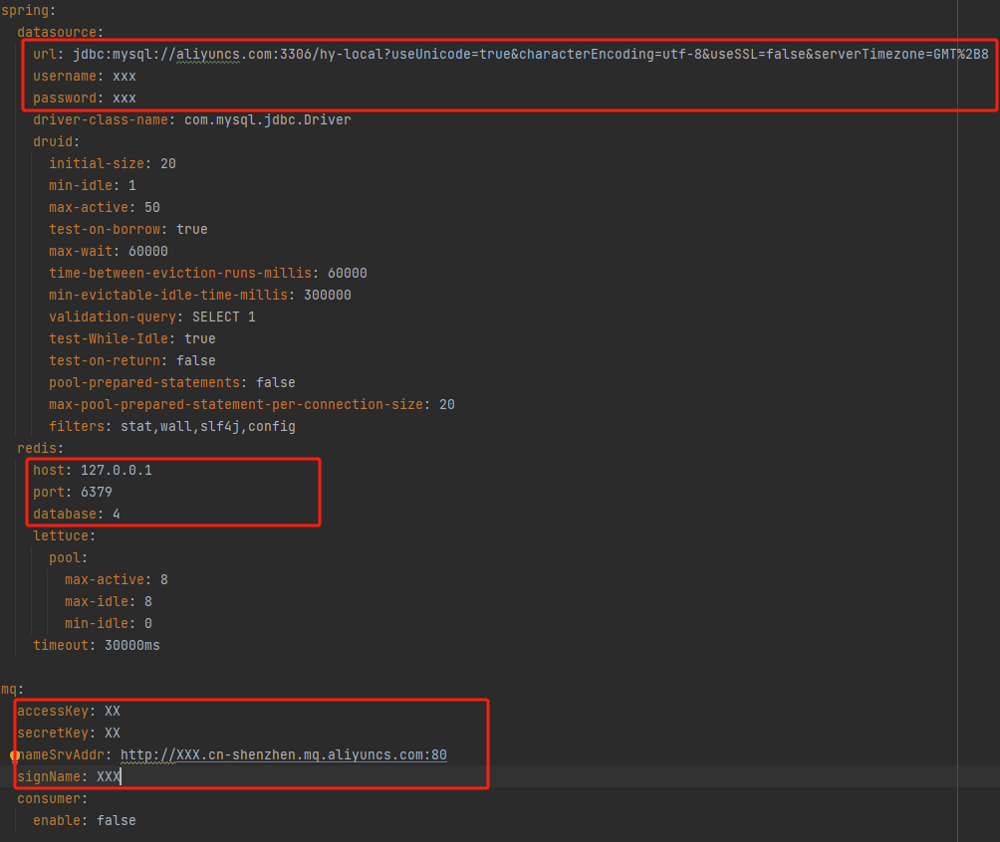

# 部署

spring boot环境以 profiles=qa 为例

### 环境

- jdk 1.8
- maven 3.8.1
- mysql > 8.0
- redis > 6.2.6
- 阿里云RockeyMQ 4.0
- 阿里云OSS
- 腾讯短信
- 发货渠道：ZBT

### 修改配置

- 公用配置： application.yml
- 环境特有配置： application-qa.yml 

#### 修改示例图



### 打包

会在项目下生成target文件夹包含jar
```
# env为部署环境，此次qa即测试环境

mvn -Denv=qa clean package -Dmaven.test.skip=true
```

### jar部署front api
```
java –jar front.jar --spring.profiles.active=qa
```
